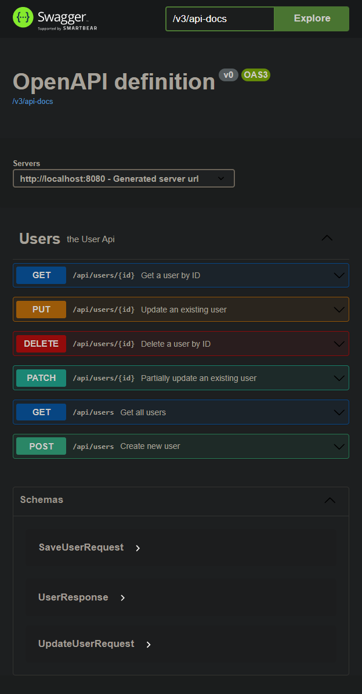

# Spring Boot User Management API and PostgreSQL (Dockerized)

Simple Spring boot application with the following characteristics:
- REST API with User Table, supports idempotent GET, PUT, POST, DELETE operations
- **PostreSQL image** available in docker container
- Standard **REST Controller** - **Service** - **Repository** pattern for separation of concerns
- Basic Authentization used by Spring Security
- API errors in RFC-7807 format
- OpenAPI documentation at http://localhost:8080/swagger-ui/index.html#/
- REST Endpoint at http://localhost:8080/users
- Passwords are masked in log
- Unit tests are based on @Nested classes for better readability

## To run local Spring boot and PostgreSql image:

1) Start docker daemon
2) Start PostreSQL Image And Springboot
``` bash
docker-compose up -d postgres-db && ./gradlew bootRun
```

3) Application REST API is available at http://localhost:8080/users

## To Run dockerize Spring Boot and PostgreSql images:

1) Start docker daemon
2) Run both images
``` bash
docker-compose up
```
3) Application REST API is available at http://localhost:8080/users

To check details like ports, etc. run
``` bash
docker ps
```

## REST API details

- **Endpoint**: http://localhost:8080/users
- **Documentation**: http://localhost:8080/swagger-ui/index.html#/ (no security)
- **Security**: Basic Auth
  - Admin: username = admin / password = password
  - User: Saved in DB



### Notes:

#### Run all Tests
``` bash
./gradlew test
```

#### Run Spring boot
``` bash
./gradlew bootRun
```

#### Clean, build, test before commit
``` bash
./gradlew clean && ./gradlew build
```


#### Setup images option only
``` bash
docker build .
```

### Setup images option only from new source
``` bash
docker build --no-cache .
```

#### Start Postgres image
``` bash
docker-compose up postgres-db
```

Todo:
- Paginated get all users
- username as ID?
- Consider H2 regardles, so application can be ran without postgres running
- Use version variables in properties file to make sure no new version breaks the project
- more tests...
- DB not up test to fail early(Caused by: org.hibernate.service.spi.ServiceException: Unable to create requested service [org.hibernate.engine.jdbc.env.spi.JdbcEnvironment] due to: Unable to determine Dialect without JDBC metadata (please set 'jakarta.persistence.jdbc.url' for common cases or 'hibernate.dialect' when a custom Dialect implementation must be provided))
- use BCryptPasswordEncoderTests instead of the base class to be testable
- Also look into TestContainers to run dockerized DB automaticaly on test run
- DAO...
- etc...